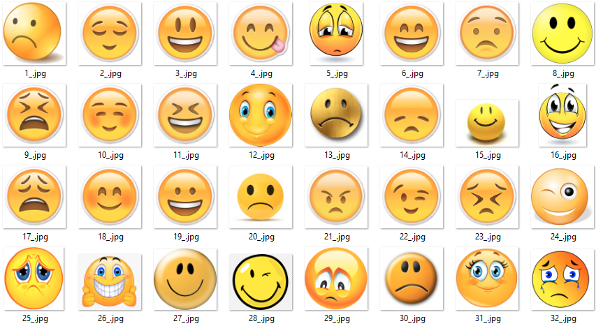
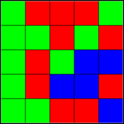

## Модуль 1. Раздел 2. Формат стеганографических задач на олимпиаде имени Верченко

---

### Полезные ссылки

- [Архив задач на официальном сайте олимпиады](https://ikb.mtuci.ru/archive_task/)
- [Зеркало архива задач](https://v-olymp.ru/tasks-archive?year=&category=&grade=&page=1&subject=information_security)

---

> Нумерация и формат задач могут меняться от года к году, однако большинство принципов решения остаются одинаковыми.

---

## №1. Тестовый вариант заключительного этапа 2026 года

### Условие

> Аналитику удалось обнаружить папку с графическими изображениями, в которой скрыто осмысленное кодовое слово.  
> Помогите определить кодовое слово, если известно, что для его сокрытия содержимое файлов **не изменялось**.  
> 

### Решение

Начнём с анализа папки(контейнера). Изображения расположены в определённом порядке (по их нумерации) и содержат только **два типа смайликов**: весёлые и грустные.

Попробуем сопоставить каждому смайлику один бит информации:

- 😀 → `1`
- ☹️ → `0`

Тогда получим следующую двоичную последовательность (полезную нагрузку):

```text
01110101011100110110010101110010
```

Каждая строка состоит из **8 смайликов**, поэтому разобьём последовательность на байты:

```text
01110101
01110011
01100101
01110010
```

Каждый байт представляет собой число, записанное в двоичной системе счисления. Преобразуем их в десятичную систему:

```
117, 115, 101, 114
```

Теперь осталось интерпретировать полученные числа как коды символов **ASCII**.

| Код | Символ |
| ---: | :----: |
| 117 | u |
| 115 | s |
| 101 | e |
| 114 | r |

Получаем кодовое слово:

```text
user
```

---

### Полное решение на Python

```python
bits = [
    "01110101",
    "01110011",
    "01100101",
    "01110010",
] # Записали последовательность в список

numbers = [int(x, 2) for x in bits] # Преобразуем каждую строку в десятичное число
answer = "".join(chr(x) for x in numbers) # Преобразуем каждое число в символ ASCII и соединяем их в строку

print(answer)
```

---

## №2. Второй вариант для 8-10 классов заключительного этапа 2026 года

### Условие

> Отдел информационной безопасности «Тринити-Код» расследует утечку конфиденциальных данных.
>
> В ходе расследования у системного администратора обнаружено странное изображение. 
> Известно, что администратор скрыл в нём имя своего сообщника.  
> Необходимо проанализировать изображение и определить имя сообщника.  
> 
>   
> 
> <u>К задаче прилагается: [ASCII-таблица](../materials/module-1/section-2/ASCII_table.pdf) </u>

### Решение

Начнём с анализа изображения(контейнера). На нём используются только **три цвета**: красный, зелёный и синий.

Предположим, что каждый цвет соответствует одной цифре троичной системы счисления:

- Красный → `0`
- Зелёный → `1`
- Синий → `2`

Тогда получаем следующую тернарную последовательность (полезную нагрузку):

```text
1000111010101221022011002
```

Каждая строка состоит из **5 цветов**, поэтому разделим последовательность на группы по пять цифр:

```text
10001
11010
10122
10220
11002
```

Поскольку используется троичная система счисления, преобразуем каждую строку в десятичное число:

```text
82, 111, 98, 105, 110
```

Теперь интерпретируем эти числа как символы таблицы **ASCII**.

| Код | Символ |
| ---: | :----: |
| 82 | R |
| 111 | o |
| 98 | b |
| 105 | i |
| 110 | n |

Получаем имя сообщника:

```text
Robin
```

---

### Полное решение на Python

```python
colors = [
    "10001",
    "11010",
    "10122",
    "10220",
    "11002",
] # Записали последовательность в список

answer = [int(x,3) for x in colors] # Преобразуем каждую строку в десятичное число
answer = "".join(chr(x) for x in answer) # Преобразуем каждое число в символ ASCII и соединяем их в строку

print(answer)
```
---

> В условиях задач не указано, как именно сопоставить объекты с цифрами.
> Однако число возможных соответствий невелико: всего **2! = 2** варианта для первой задачи
> и **3! = 6** — для второй. 
> Поэтому все варианты можно быстро проверить вручную или перебрать программно.

---

## Основные идеи задач

Обобщим основные идеи, которые часто встречаются в стеганографических задачах олимпиады имени Верченко.

1. В таблице **ASCII** каждому символу соответствует уникальный **байт**. Поэтому полученную последовательность обычно разбивают на группы по **8 бит** (или в соответствии со структурой, заданной в условии задачи).
2. В задачах могут использоваться различные системы счисления: двоичная, троичная, шестнадцатеричная и другие.
3. Ответом, как правило, является **осмысленное слово**. Если получилась бессмысленная последовательность символов, попробуйте изменить сопоставление объектов с цифрами или проверьте правильность разбиения последовательности.
4. Внимательно анализируйте условие задачи. В нём могут содержаться важные подсказки, например явные упоминания **ASCII**, системы счисления, размера групп или способа кодирования данных.