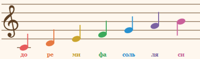
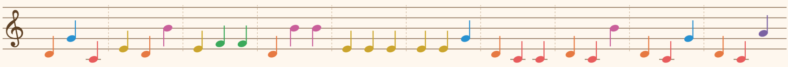

## Модуль 1. Раздел 3. Практика решения задач прошлых лет.

---

### Все задачи в этом разделе взяты отсюда

- [Архив задач на официальном сайте олимпиады](https://ikb.mtuci.ru/archive_task/)
- [Варианты за все года](https://ikb.mtuci.ru/materials/)
- [Зеркало архива задач](https://v-olymp.ru/tasks-archive?year=&category=&grade=&page=1&subject=information_security)

---

Ученику предлагается решить задачи прошлых лет,
чтобы закрепить полученные знания и отработать навыки решения стеганографических задач.  
Код пишите **сами** на python3 с использование только стандартной библиотеки (другого на олимпиаде не будет).


Рекомендуемое время на решение:
- **Задача №1** — до 15 минут.
- **Задача №2** — до 30 минут (подсказку рекомендуется открыть после 10 минут самостоятельных попыток).
---

## №1. Заключительный этап. 11 класс. 2026 год. (Уровень: **Легко**)

### Условие
> Отдел информационной безопасности музыкального журнала «Седьмая нота» расследует утечку
> конфиденциальных данных. В ходе расследования установлено, что администратор передает
> пароли пользователей своему сообщнику используя музыкальные ноты 
> (до, ре, ми, фа, соль, ля, си). 
> 
>   
> Рисунок 1 – Нотная нотация 
> 
> В электронной почте администратора обнаружена следующая странная мелодия (рисунок 2).
> Вам необходимо проанализировать содержимое и определить скомпрометированный пароль. 
> 
> 
> Рисунок 2 – Странная мелодия


> [!Подсказка]
> Сколько всего нот и как это связано с системой счисления?

> [!Решение]
> 
> ```python
> notes = {
>     "ДО": "0",
>     "РЕ": "1",
>     "МИ": "2",
>     "ФА": "3",
>     "СОЛЬ": "4",
>     "ЛЯ": "5",
>     "СИ": "6",
> } # Словарь для перевода
> 
> bars = [
>     ["РЕ", "СОЛЬ", "ДО"],
>     ["МИ", "РЕ", "СИ"],
>     ["МИ", "ФА", "ФА"],
>     ["РЕ", "СИ", "СИ"],
>     ["МИ", "МИ", "МИ"],
>     ["МИ", "МИ", "СОЛЬ"],
>     ["РЕ", "ДО", "ДО"],
>     ["РЕ", "ДО", "СИ"],
>     ["РЕ", "ДО", "СОЛЬ"],
>     ["РЕ", "ДО", "ЛЯ"],
> ] # Разделяем по тактам, как показано на рисунке (доп.: в 3 семиричных цифрах ≈1 байт)
> 
> answer = ""
> 
> for bar in bars:
>     base7 = "".join(notes[note] for note in bar)  # Получаем семеричное число
>     code = int(base7, 7)                          # Переводим в десятичную систему
>     answer += chr(code)                           # Преобразуем код ASCII в символ
> 
> print(answer)
> ```

> [!Ответ]  
> Mozart1756

---

## №2 Заключительный этап 11 класс. 2025 года. (Уровень: **Сложно**)

### Условие
> После успешного прохождения аутентификации и запуска специальной программы на
> ноутбуке был обнаружен скрытый раздел, на котором хранились файлы с историей переписки.
> Установлено, что в тексте переписки спрятан адрес следующей цели атаки хакеров. У команды
> аналитиков есть подозрение, что использовался метод, связанный с количеством пробелов в
> каждом абзаце.
> Помогите найти закономерность в сообщении и расшифровать данные, указывающие на
> следующую цель хакеров. В ответе укажите следующую цель хакеров.
> 
> К задаче прилагается: 
> файл [«message_v1.txt»](../materials/module-1/section-3/task-2/message_v1.txt)

> [!Подсказка]
> Обратите внимание на 2 и 3 строку переписки

> [!Решение]
> ```python
> spaces_count = []
>
> for line in open("message_v1.txt"):
>     spaces = str(line.count(" "))  # Считаем количество пробелов в строке
>     if len(spaces) == 1:     # Если количество пробелов однозначное, добавляем ноль в начало
>         spaces = "0" + spaces
>     spaces_count.append(spaces)
> 
> byte = [ # Объединяем по 4 строки (4 × 2 бита = 1 байт)
>     "".join(spaces_count[4 * i : 4 * (i + 1)])
>     for i in range(len(spaces_count) // 4)
> ] # Немного олпроги =)
> 
> codes = [int(x, 2) for x in byte] # Переводим двоичные числа в десятичную систему
> letters = [chr(x) for x in codes] # Преобразуем коды ASCII в символы
>
> print("".join(letters))
> ```

> [!Ответ]  
> ikb.mtuci.ru

---

В данном разделе представлено всего лишь 2 задачи,
поскольку многие схожие задачи прошлых лет затрагивают темы из следующих модулей.
Более сложные и разнообразные примеры будут рассмотрены далее в рамках курса.